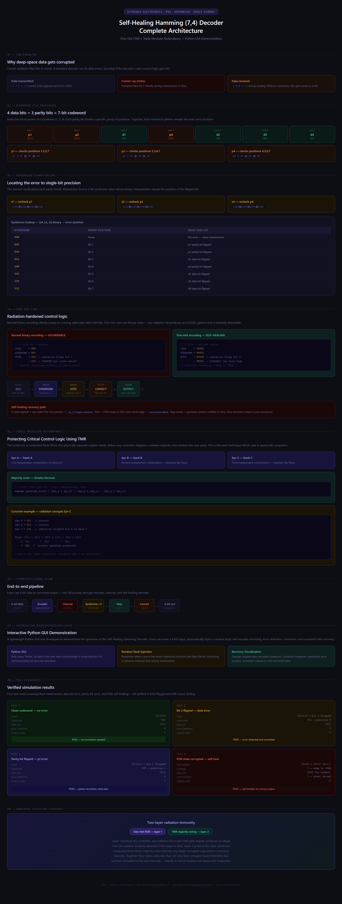
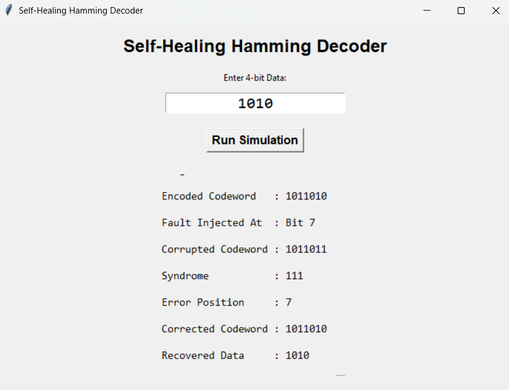
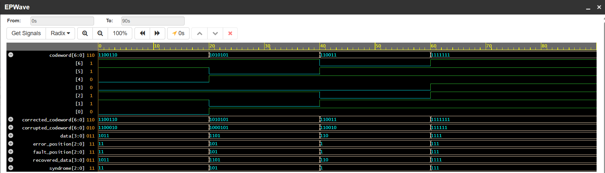

# Self-Healing Hamming Decoder

> Fault-Tolerant Error Correction System using Hamming (7,4) Code, FSM-Based Recovery, Triple Modular Redundancy (TMR), and Interactive Python Demonstration.


---

# Project Overview

Modern digital systems operating in radiation-prone environments such as satellites, aerospace systems, medical devices, and safety-critical embedded systems are vulnerable to transient faults and soft errors.

This project presents a Self-Healing Hamming Decoder capable of:

- Detecting single-bit errors
- Locating faulty bits using syndrome analysis
- Automatically correcting corrupted codewords
- Recovering from illegal FSM states
- Tolerating faults using Triple Modular Redundancy (TMR)
- Demonstrating functionality through an interactive Python GUI

The design combines traditional Hamming error correction with modern fault-tolerant design methodologies to improve reliability and resilience.

---

# Objectives

- Implement Hamming (7,4) error correction
- Detect and locate single-bit faults
- Automatically correct corrupted codewords
- Design a One-Hot Finite State Machine (FSM)
- Detect illegal FSM states
- Implement automatic FSM recovery
- Integrate Triple Modular Redundancy (TMR)
- Develop an interactive Python demonstration interface
- Validate operation using waveform analysis

---

# Features

- Hamming (7,4) Encoder
- Syndrome-Based Error Detection
- Error Localization
- Automatic Error Correction
- Self-Healing Recovery Logic
- Illegal State Detection
- One-Hot FSM Controller
- Triple Modular Redundancy (TMR)
- Interactive Python GUI
- Waveform Verification
- Fault Injection Simulation

---

# System Architecture

The complete system consists of multiple fault-tolerant modules working together to detect, locate, correct, and recover from faults.



---

# Design Flow

```text
Input Data
     │
     ▼
Hamming Encoder
     │
     ▼
Fault Injection
     │
     ▼
Syndrome Generator
     │
     ▼
Error Locator
     │
     ▼
Correction Unit
     │
     ▼
Recovered Data
```

Additional protection mechanisms:

```text
FSM Controller
     │
     ▼
Illegal State Detector
     │
     ▼
Auto-Recovery Logic
```

```text
FSM #1
FSM #2
FSM #3
   │
   ▼
Majority Voter (TMR)
   │
   ▼
Reliable Output
```

---

# Verilog Modules

| Module | Description |
|----------|-------------|
| hamming-encoder.v | Generates Hamming (7,4) codeword |
| syndrome-generator.v | Computes syndrome bits |
| error-locator.v | Determines fault position |
| correction-unit.v | Corrects corrupted bit |
| self-healing-hamming-decoder.v | Core decoder module |
| fsm-controller.v | One-Hot FSM implementation |
| illegal-state-detector.v | Detects invalid FSM states |
| autorecovery-fsm.v | Recovers FSM from illegal states |
| tmr-voting.v | Triple Modular Redundancy voter |
| complete-demo.v | Full integrated system |

---

# Python Demonstration

To improve usability and visualization, a Python demonstration layer was developed.

## Console Version

```bash
python hamming-console.py
```

Features:

- User enters 4-bit data
- Automatic fault injection
- Error detection
- Error correction
- Data recovery

---

## GUI Version

```bash
python hamming-gui.py
```

Features:

- Interactive interface
- User-friendly operation
- Random fault injection
- Complete decoding visualization



---

# Waveform Verification

Functional verification was performed using EDA Playground and EPWave.

Observed Signals:

- Input Data
- Encoded Codeword
- Corrupted Codeword
- Syndrome
- Error Position
- Corrected Codeword
- Recovered Data



---

# Example Output

```text
SELF-HEALING HAMMING DECODER DEMO

Original Data      = 1101
Encoded Codeword   = 1010101
Corrupted Codeword = 1000101

Syndrome           = 101
Error Position     = 5

Corrected Codeword = 1010101
Recovered Data     = 1101
```

---

# Fault-Tolerance Techniques Used

## Hamming Error Correction

Detects and corrects single-bit transmission errors.

## Illegal State Detection

Monitors FSM state vectors and identifies invalid states.

## Automatic Recovery FSM

Returns the FSM to a safe operational state when illegal states occur.

## Triple Modular Redundancy (TMR)

Three identical FSM modules operate in parallel.

Majority voting determines the final output.

Benefits:

- Increased reliability
- Fault masking
- Radiation resilience

---

# Repository Structure

```text
Self-Healing-Hamming-Decoder/

README.md
LICENSE
requirements.txt
sample_outputs.txt

docs/
├── architecture.png
├── gui-demo.png
└── waveform.png

python-demo/
├── hamming-console.py
└── hamming-gui.py

verilog/
├── hamming-encoder.v
├── syndrome-generator.v
├── error-locator.v
├── correction-unit.v
├── self-healing-hamming-decoder.v
├── fsm-controller.v
├── illegal-state-detector.v
├── autorecovery-fsm.v
├── tmr-voting.v
├── complete-demo.v
└── demo-testbench.v

report/
└── Self_Healing_Hamming_Decoder_Report.pdf
```

---

# Applications

- Aerospace Electronics
- Satellite Communication Systems
- Medical Devices
- Automotive Safety Systems
- Embedded Systems
- Radiation-Prone Environments
- Fault-Tolerant Computing Systems

---

# Future Scope

Future enhancements may include:

- FPGA Implementation
- Real-Time Fault Injection
- Multi-Bit Error Correction
- SECDED (Single Error Correction Double Error Detection)
- Hardware-Software Co-Design
- Enhanced GUI Analytics Dashboard
- Radiation-Hardened Hardware Prototyping

---

# Tools & Technologies

## Hardware Design

- Verilog HDL
- Digital Logic Design
- Finite State Machines

## Verification

- EDA Playground
- EPWave

## Software

- Python
- Tkinter

## Version Control

- Git
- GitHub

---

# Author

**Akshita Singh**

# License

This project is released under the MIT License.

---
